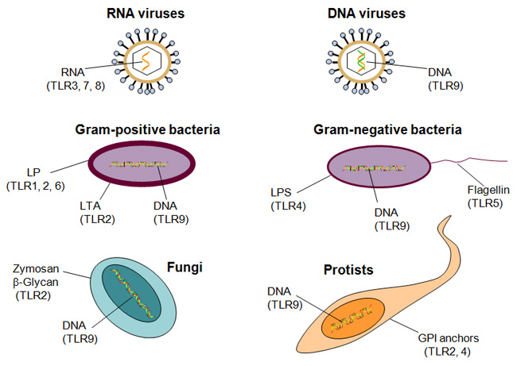
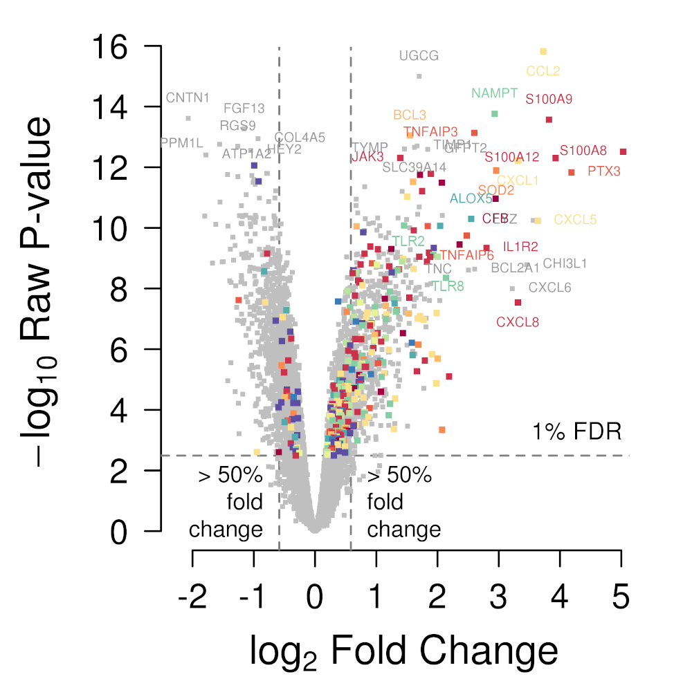
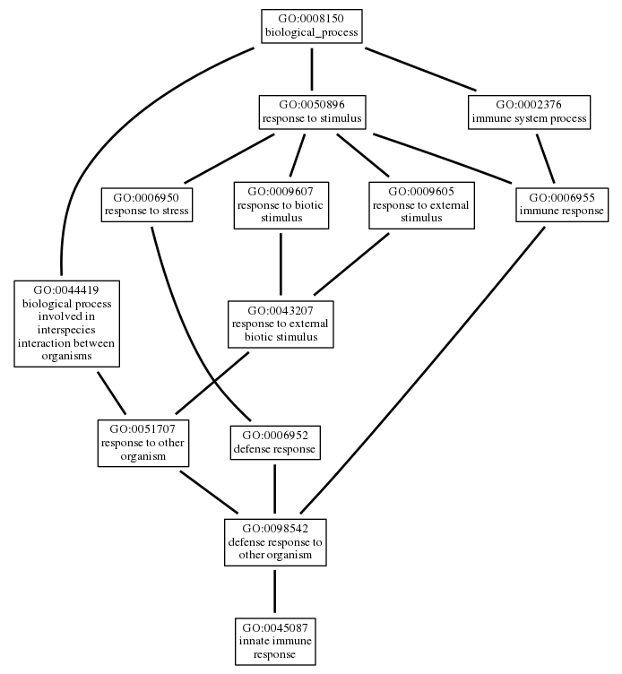
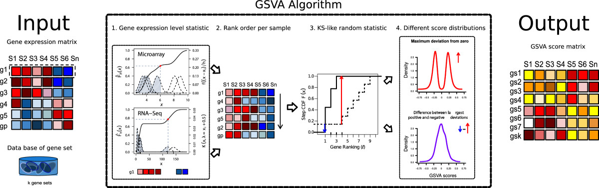

```{r setup, include=FALSE, cache=FALSE}
options(htmltools.dir.version = FALSE, width=80)
knitr::opts_chunk$set(warning = FALSE, message = FALSE, cache=TRUE)

## from http://yihui.name/knitr/hooks#chunk_hooks
knitr::knit_hooks$set(small.mar=function(before, options, envir) {
                      if (before) par(mar=c(4, 5, 1, 1)) ## smaller margin on top and right
})
```

class: inverse, center, middle
background-image: url(img/portada_curso.jpg)
background-size: contain

---

class: title-slide, middle, center

# Mini curso: Análisis de enriquecimiento funcional de conjuntos de genes en R

.large[Robert Castelo]

.large[robert.castelo@upf.edu | @robertclab]

.large[Universidad Pompeu Fabra | Barcelona]


---

# Vías biológicas diferencialmente expresadas

* La interpretación de una lista de genes diferencialmente expresados (DE) suele ser más util cuando la hacemos en términos de vías biológicas (_biological pathways_).

* Una **vía biológica** es una serie de acciones entre moléculas de una célula que conduce a un determinado producto o a un cambio en la célula; vean la página educacional correspondiente del
[NHGRI](https://www.genome.gov/es/about-genomics/fact-sheets/Vias-Biologicas) para una descripción más ámplia.

* Dado que los genes actúan colectivamente bajo el control de programas de regulación molecular, un modelo
más cercano a la biología subyacente es aquel en que las vías biológicas son las que se expresan diferencialmente.

* Una aproximación sería intentar hacer el análisis de expresión diferencial **directamente** a nivel de vía
biológica, o **indirectamente** buscando la sobre-representación (enriquecimiento) de nuestros genes DE en
cada vía de **interés**.

---

# Definiciones de vías biológicas

* Consideremos primero restrigir la búsqueda de vías biológicas DE a aquellas que son conocidas.

* Bases de datos como [Reactome](https://www.reactome.org) o [KEGG](https://www.genome.jp/kegg)
anotan información de la literatura sobre los genes, la proteinas and las reacciones que forman
las vías biológicas.

* Una forma simple pero muy útil de definir vías biológicas es en terminos de **conjuntos de genes**,
irrespectivamente de las interacciones moleculares que pueda haber entre ellos y/o sus productos.

* Hay muchas bases de datos de conjuntos de genes, siendo las más populares
[The Gene Ontology (GO) project](http://geneontology.org) y
[The Molecular Signatures Database (MSigDB)](https://www.gsea-msigdb.org/gsea/msigdb).

* A menudo las bases de datos no incluyen las vías biológicas que són más relevantes al sistema
que estamos estudiando. En tal caso, deberíamos de o bien curar nuestros propios conjuntos de genes,
o bien utilizar técnicas para inferirlos a partir de los datos.

---

# Definiciones de vías biológicas

* Por ejemplo, piensen en genes que codifican por proteinas involucradas en la respuesta inmune innata.
Concretamente, aquellos q detectan patógenos humanos.


.center2[

]

.footnote[Fig. 1. Christmas P. Toll-Like Receptors: Sensors that Detect Infection. <a href="https://www.nature.com/scitable/topicpage/toll-like-receptors-sensors-that-detect-infection-14396559#"><em>Nature Education</em>, 3(9):85, 2010.</a>]

---

# Idea general del enriquecimiento functional

* Teniendo en mente la definición de la vía biológica previa, qué podríamos concluir a partir de la siguiente
gráfica de tipo volcán?

.center2[

]

.footnote[Fig. 1a. Costa D and Castelo R. Umbilical cord gene expression reveals the molecular architecture of the fetal inflammatory response in extremely preterm newborns. <a href="https://dx.doi.org/10.1038/pr.2015.233"><em>Pediatric Research</em>, 79:473-481, 2016.</a>]

---

# Idea general del enriquecimiento functional

* Una forma conveniente de encontrar vías biológicas DE, en términos de conjuntos de genes DE, es detectando
lo que se suele llamar un **enriquecimiento funcional** a través de los siguientes dos pasos:
  <br>
  1. Buscar genes DE.
  2. Para cada conjunto de genes, verificar si esos genes DE pertenecen a ese conjunto
     en una proporción que excede cualquier expectativa de encontrar ese número de genes
     en ese conjunto únicamente por azar.

* En este contexto, cuando un conjunto de genes contiene **más** genes DE que los que podríamos esperar
por puro azar, decimos que este conjunto de genes esta **enriquecido** en genes DE.

* Una forma fácil de aplicar esta estrategia es utilizando la llamada
[prueba exacta de Fisher ](https://es.wikipedia.org/wiki/Prueba_exacta_de_Fisher)
(también conocida como prueba hipergeométrica).

---

# La prueba exacta de Fisher

* **Hipótesis nula**: el conjunto de genes no incluye más genes DE que los que podríamos esperar únicamente
por azar. Esta hipótesis nula se suele formalizar con el llamado **modelo de la urna**:

.left-column[


]

.right-column[
* Universo de genes: todos los genes que **consideramos**.
* Hay una bola en la urna para cada gen del universo de genes.
* Cada bola está etiquetada con un único identificador de gen.
* Las bolas blancas representan genes **DE**.
* Las bolas negras representan genes **no-DE**.
* Sacar a ciegas (uniformemente al azar) tantas bolas de la urna
  como genes tenemos en el conjunto de genes para el que hacemos la
  prueba, sin volverlas a poner en la urna (muestreo **sin reemplazamiento**).
* El número de **bolas blancas** sacadas de esta manera de la urna (i.e., el número
  de genes DE del conjunto para el que hacemos la prueba) sigue una
  [distribución hipergeométrica](https://es.wikipedia.org/wiki/Distribuci%C3%B3n_hipergeom%C3%A9trica).
]

---

# La prueba exacta de Fisher

* Consideramos las siguientes cantidades:

  * $N$ es el número total de genes __considerados__ (tamaño de nuestro universo de genes).
  * $n$ es el número de genes DE.
  * $m$ es el número de genes del conjunto para el que hacemos la prueba.
  * $k$ es el número de genes DE en el conjunto para el que hacemos la prueba.

* La [prueba exacta de Fisher](https://es.wikipedia.org/wiki/Prueba_exacta_de_Fisher)
se utiliza ampliamente en el análisis de tablas de contingencia resultantes de clasificar
objetos a través de dos factores los cuales en nuestro caso son la pertenencia a un conjunto
de genes y si un gen es DE o no:


GENES               | DE    | no-DE     | Total  
--------------------|-------|-----------|------
DENTRO DEL CONJUNTO |  $k$  | $m-k$     | $m$
FUERA DEL CONJUNTO  | $n-k$ | $N+k-n-m$ | $N-m$
TOTAL               | $n$   | $N-n$     | $N$

---

# La prueba exacta de Fisher

* Dados los valores $N$, $n$, $m$ y $k$ y una variable aleatoria $X$ representando los posibles
resultados del experimento con la urna, la probabilidad de observar exactamente $k$ genes en el
conjunto de genes para el que hacemos la prueba es:

$$ \textrm{Pr}(X=k) = \frac{ {m \choose k} {N-m \choose n-k} }{ N \choose n }\,. $$

* La probabilidad de observar $k$ **o más** genes DE en un conjunto de genes bajo la hipótesis
nula es:

$$ \textrm{Pr}(X >= k)=\sum_{x=k}^{\textrm{min}(m, n)} \frac{ {m\choose x} {N-m\choose n-x} }{ {N\choose n} }\,. $$
* Esta probabilidad corresponde al $p$-valor de una
[prueba exacta de Fisher](https://es.wikipedia.org/wiki/Prueba_exacta_de_Fisher) unilateral (_one-tailed_)
para la hipótesis nula de no-asociación entre dos factores.

* Este es el $p$-valor para la hipótesis nula de no-enriquecimiento de genes
DE en el conjunto de genes. Cuanto menor sea el $p$-valor, menos consistente con el puro azar
será la observación de los $k$ genes DE en el conjunto.

---

class: small-code

# La prueba exacta de Fisher

* Recordemos la fórmula de la probabilidad de observar $k$ **o mas** genes DE en un conjunto de genes bajo
la hipótesis nula:

$$ \textrm{Pr}(X >= k)=\sum_{x=k}^{\textrm{min}(m, n)} \frac{ {m\choose x} {N-m\choose n-x} }{ {N\choose n} }\,. $$

* Consideremos un ejemplo de juguete donde tenemos unos datos de expresión génica para $N=10$ genes,
de los cuales $m=4$ pertenecen a un conjunto de genes de nuestro interés y donde identificamos $n=2$
genes como DE. Supongamos que entre los $n=2$ genes DE hay $k=1$ que pertenece al conjunto de genes.
Cuál sería el $p$-valor que nos dice si este conjunto de genes esta enriquecido significativamente en
genes DE?

```{r}
N <- 10
m <- 4
n <- 2
k <- 1
choose(m, 1) * choose(N-m, n-1) / choose(N, n) + choose(m, 2) * choose(N-m, n-2) / choose(N, n)
```

---

class: small-code

# La prueba exacta de Fisher

* El cálculo anterior lo podemos hacer directamente utilizando la función de R `phyper()` para
calcular la masa de la distribución hipergeométrica de la siguiente forma:

```{r}
phyper(k-1, m, N-m, n, lower.tail=FALSE)
```

* Esto nos permite jugar facilmente con las cantidades involucradas en este cálculo, por ejemplo
aumentando el número de genes $N$ en nuestros datos de expresión.

```{r}
N <- 11
phyper(k-1, m, N-m, n, lower.tail=FALSE)
N <- 12
phyper(k-1, m, N-m, n, lower.tail=FALSE)
N <- 13
phyper(k-1, m, N-m, n, lower.tail=FALSE)
```

---

class: small-code

# La prueba exacta de Fisher

* El $p$-valor de la prueba depende del tamaño $N$ del universo de los genes!

```{r universeByN, fig.align="center", fig.width=5, fig.height=4, out.height="400px", small.mar=TRUE, dpi=300}
pn <- sapply(10:400, function(N) phyper(k-1, m, N-m, n, lower.tail=FALSE))
plot(10:400, pn, type="l", xlab="N", ylab="Pr(X>=k)", las=1, lwd=2, cex.axis=1.2, cex.lab=1.5)
abline(h=0.05, lty=3, lwd=2, col="red")
```

---

class: small-code

# La prueba exacta de Fisher

.pull-left[
* La función de R `fisher.test()` nos permite hacer la prueba exacta unilateral de Fisher de la
siguiente manera.

* Consideramos la organización previa de la tabla de contingencia de genes DE y de pertenecia a
un conjunto de genes:

.small-table[

GENES               | DE    | no-DE     | Total  
--------------------|-------|-----------|------
DENTRO DEL CONJUNTO |  $k$  | $m-k$     | $m$
FUERA DEL CONJUNTO  | $n-k$ | $N+k-n-m$ | $N-m$
TOTAL               | $n$   | $N-n$     | $N$

]

* Para llevar a cabo la prueba exacta de Fisher de forma **unilateral**, debemos utilizar el
parámetro `alternative="greater"`.
]

.pull-right[
```{r, tidy=FALSE}
N <- 10
dnames <- list(CG=c("dentro","fuera"),
               DE=c("sí","no"))
t <- matrix(c(k, n-k, m-k, N+k-n-m),
            nrow=2, ncol=2, dimnames=dnames)
t
fisher.test(t, alternative="greater")
```
]

---

class: small-code

# La prueba exacta de Fisher

<!--
<br>

-->

* Ejemplo con el [fichero de resultados](dat/ttFIRinELGANsUCtissue.rds) del
análisis de expresión diferencial de
[Costa and Castelo (2016)](https://dx.doi.org/10.1038/pr.2015.233).

```{r}
tt <- readRDS(file.path("dat", "ttFIRinELGANsUCtissue.rds"))
dim(tt)
head(tt, n=3)
```

* Identificamos genes DE (FDR < 1%, mínimo 50% de cambio) y formamos el conjunto de genes TLR.

```{r}
genesDE <- tt$Symbol[tt$adj.P.Val < 0.01 & abs(tt$logFC) > log2(1.5)]
length(genesDE)
head(genesDE)
TLRs <- tt$Symbol[grep("TLR", tt$Symbol)]
TLRs
```

---

class: small-code

# La prueba exacta de Fisher

* Construimos la tabla de contingencia y hacemos la prueba exacta de Fisher.

```{r}
m <- length(TLRs)
N <- nrow(tt)
n <- length(genesDE)
k <- length(intersect(genesDE, TLRs))
t <- matrix(c(k, n-k, m-k, N+k-n-m),
            nrow=2, ncol=2, dimnames=dnames)
t
fisher.test(t, alternative="greater")
```

---

# El análisis de _Gene Ontology_

* Un _análisis de Gene Ontology (GO)_ es un análisis de enriquecimiento funcional
aplicado a cada uno de los conjuntos de genes de la
[base de datos de GO](http://geneontology.org).

* La [base de datos de GO](http://geneontology.org) proporciona un vocabulario
controlado para describir atributos de genes y sus productos para cualquier organismo.
Consiste de los llamados **términos GO**, los cuales are pares de identificador de
término (GO ID) y su descripción.

|     GO ID | Descripción           |
|-----------|-----------------------|
|GO:0045087 | innate immune response|
|GO:0006955 | immune response       |
|GO:0006950 | response to stress    |

* Un término GO pertenece a una de las siguientes tres ontologías: _Biological Process (BP)_,
_Molecular Function (MF)_ y _Cellular Component (CC)_.

* El producto de un gen puede asociarse con o localizarse en uno o más **componentes celulares**
y estar activo en uno o más **procesos biológicos** durante los cuales realiza una o más
**funciones moleculares**.

---

# El análisis de _Gene Ontology_

.pull-left[

* Dentro de una ontología, los términos GO estan relacionados unos con otros a través de relaciones
jerárquicas que describen cuándo un término GO es más general que otro más específico.

* Detalles en este u otros aspectos están descritos en
[http://geneontology.org/docs/ontology-documentation](http://geneontology.org/docs/ontology-documentation)

* Para poder llevar a cabo un análisis de GO necesitamos anotaciones sobre los genes que nos
digan a qué términos GO están asociados.

]

.pull-right[

]

---

class: small-code

# El análisis de _Gene Ontology_

* El paquete de Bioconductor [org.Hs.eg.db](https://bioconductor.org/packages/org.Hs.eg.db) contiene
anotaciones diversas para los genes humanos, incluyendo anotaciones de términos GO.

```{r}
library(org.Hs.eg.db)
allHumanGO <- select(org.Hs.eg.db, columns="GO", keys=keys(org.Hs.eg.db, keytype="SYMBOL"),
                     keytype="SYMBOL")
dim(allHumanGO)
head(allHumanGO, n=3)
```

* Las anotaciones de términos GO sobre los genes incluyen la trazabilidad del origen de la
anotación mediante los [códigos de evidencia](http://geneontology.org/docs/guide-go-evidence-codes).

```{r}
sort(table(allHumanGO$EVIDENCE), decreasing=TRUE)
```

---

class: small-code

# El análisis de _Gene Ontology_

* Contrastamos si el término GO _innate immune response_ (GO:0045087)
está enriquecido con los genes DE de
[Costa and Castelo (2016)](https://dx.doi.org/10.1038/pr.2015.233).

```{r}
genesIIR <- allHumanGO$SYMBOL[allHumanGO$GO %in% "GO:0045087"]
m <- length(intersect(genesIIR, tt$Symbol)) ## incluir sólo genes analizados en el conjunto
k <- length(intersect(genesDE, genesIIR))
t <- matrix(c(k, n-k, m-k, N+k-n-m),
            nrow=2, ncol=2, dimnames=dnames)
t
fisher.test(t, alternative="greater")
```

---

# El análisis de _Gene Ontology_

* Hay miles de conjuntos de genes definidos por los términos GO.

```{r}
length(unique(allHumanGO$GO))
```

* Existen múltiples paquetes de R disponibles en
[CRAN](https://cran.r-project.org) y [Bioconductor](https://bioconductor.org)
que permiten llevar a cabo un análisis de enriquecimiento funcional automáticamente
para todos los términos GO.

* Aquí ilustraremos este tipo de análisis con el paquete
[GOstats](https://bioconductor.org/packages/GOstats).

```{r}
library(GOstats)
```

* Con
[GOstats](https://bioconductor.org/packages/GOstats)
el análisis consiste de los siguientes tres pasos:

  1. Construir un **objeto** de parámetros que especifican información como cuál es
  el universo de los genes, que genes consideramos DE, etc.
  2. Ejecutar el análisis de enriquecimiento funcional.
  3. Almacenar y visualizar los resultados.
  
---

class: small-code

# El análisis de _Gene Ontology_

* Construimos un objeto de parámetros utilizando identificadores
[Entrez Gene](https://doi.org/10.1093/nar/gkl993) para los genes:

```{r}
universoEntrez <- rownames(tt)
genesDEentrez <- rownames(tt)[tt$adj.P.Val < 0.01 & abs(tt$logFC) > log2(1.5)]
params <- new("GOHyperGParams", geneIds=genesDEentrez, universeGeneIds=universoEntrez,
              annotation="org.Hs.eg.db", ontology="BP", pvalueCutoff=0.01)
```

* Ejecutamos el análisis de enriquecimiento funcional (dura unos minutos).

```{r}
hgOver <- hyperGTest(params)
hgOver
```

* Almacenamos y visualizamos los [resultados](analisisGO.html).

```{r}
htmlReport(hgOver, file="analisisGO.html")
```
```{r, eval=FALSE}
browseURL("analisisGO.html")
```

---

class: small-code

# El análisis de _Gene Ontology_

* El objeto retornado por `hyperGTest()` pertenece la clase
`GOHyperGResult`. La página de ayuda de `HyperGResult-accessors`
contiene información sobre qué métodos se pueden utilizar para
explorar los resultados programáticamente.

```{r, eval=FALSE}
help("HyperGResult-accessors")
```

* Un método muy útil es `summary()` ya que nos proporciona un objeto
`data.frame` con los resultados de la prueba exacta de Fisher para cada
término GO que cumple el umbral del $p$-valor especificado en el objeto
de parámetros.

```{r}
resHgOver <- summary(hgOver)
dim(resHgOver)
head(resHgOver, n=3)
```

---

class: small-code

# El análisis de _Gene Ontology_

* Otros métodos de acceso a los resultados son.

```{r}
head(geneCounts(hgOver))
head(universeCounts(hgOver))
head(pvalues(hgOver))
length(pvalues(hgOver))
```

* Estos métodos proporcionan los resultados de las pruebas realizadas
**todos** los términos GO, y no solamente a los que tienen un $p$-valor
debajo del umbral utilizado.

---

class: small-code

# El análisis de _Gene Ontology_

.pull-left[

* La jerarquía de términos GO y sus solapamientos hacen que las pruebas
de hipótesis sean muy dependientes entre ellas.

* Si un término está enriquecido significativamente, es probable que el
término inmediamente superior también lo esté, y sin embargo el término
más específico siempre será más relevante.

* Una solución consiste en analizar de los términos más específicos a los
más generales, eliminando los genes que enriquecen un término significativo,
del término inmediatamente más general en la jerarquía
([Alexa et al., 2006](https://doi.org/10.1093/bioinformatics/btl140)).

]

.pull-right[

]

---

class: small-code

# El análisis de _Gene Ontology_

* En el paquete
[GOstats](https://bioconductor.org/packages/GOstats)
esta estrategia se puede utilizar configurando el argumento
`conditional=TRUE` en el objeto de parámetros.

```{r}
conditional(params) <- TRUE
```

* Luego procedimos exactamente igual que hicimos antes.

```{r}
hgOverCond <- hyperGTest(params)
hgOverCond
htmlReport(hgOverCond, file="analisisGOcondicional.html")
```

* En esta nueva [tabla de resultados](analisisGOcondicional.html),
el número de términos GO significativos es menor que cuando utilizamos
la prueba _incondicional_ (`conditional=FALSE`).

---

class: small-code

# El análisis de _Gene Ontology_

* Los términos GO anotados en pocos genes (e.g., $m < 3$) o enriquecidos
también por pocos genes (e.g., $k < 3$) son menos fiables que los que
involucran más genes. Por otro lado, los términos GO anotados a muchos
genes (e.g., $m > 300$) pueden ser demasiado generales para resultar
útiles.

* Para intentar identificar los términos GO enriquecidos más interesantes
y fiables podemos filtrar los resultados de la siguiente forma.

```{r}
resGO <- summary(hgOverCond)
resGO <- resGO[resGO$Size >= 5 & resGO$Size <= 300 & resGO$Count >= 5, ]
resGO <- resGO[order(resGO$OddsRatio, decreasing=TRUE), ]
head(resGO)
```

---

class: small-code

# El análisis de _Gene Ontology_

* Mediante el método `geneIdsByCategory()` podemos extraer los genes que
_enriquecen_ cada término GO y pegarlos al resultado de la siguiente manera.

```{r}
idGenes <- geneIdsByCategory(hgOverCond)[resGO$GOBPID]
simGenes <- sapply(idGenes, function(ids) tt[ids, "Symbol"])
simGenes <- sapply(simGenes, paste, collapse=", ")
resGO <- cbind(resGO, Genes=simGenes)
rownames(resGO) <- 1:nrow(resGO)
```

* Podemos generar una tabla de resultados con toda esta información mediante
la funcion `kable` del paquete
[knitr](https://cran.r-project.org/package=knitr) y las funciones
`kable_styling()` y `save_kable()` del paquete
[kableExtra](https://cran.r-project.org/package=kableExtra).

```{r}
library(knitr)
library(kableExtra)

ktab <- kable(resGO, "html", caption="Resultados análisis GO.", row.names=TRUE)
ktab <- kable_styling(ktab, bootstrap_options=c("stripped", "hover", "responsive"),
                      fixed_thead=TRUE)
save_kable(ktab, file="analisisGOfiltrado.html", self_contained=TRUE)
```

* La tabla de resultados se puede ver a través de este
[enlace](analisisGOfiltrado.html).

---

# Observaciones finales sobre enriquecimiento funcional con la prueba exacta de Fisher

* Un análisis de enriquecimiento funcional mediante la prueba exacta
unilateral de Fisher es una manera fácil de abordar la cuestión de
qué vías biológicas pueden estar DE.

* Este tipo de técnicas están limitadas por la cantidad de genes DE
que podemos obtener de nuestros datos.

* El número total de genes involucrados en los cálculos
(el _universo de los genes_) tiene influencia en el $p$-valor de la
prueba exacta de Fisher.

* Cuando llevamos a cabo un "análisis de GO" puede ser importante hacerlo
teniendo en cuenta la estructura jerárquica de la ontología de GO.

* Las bases de datos de conjuntos de genes no siempre pueden contener
aquellos conjuntos más relevantes a la biología del sistema que estamos
estudiando.

---

# Métodos GSEA

* Los métodos de enriquecimiento funcional basados en pruebas de
sobre-representación como la prueba exacta de Fisher, tienen la
limitación de que necesitan una lista mínimamente grande de genes DE (>= 30).

* Existen contextos biológicos donde la magnitud de los cambios de
expresión diferencial puede ser pequeña y podemos llegar a identificar
solamente unos pocos genes DE (e.g., enfermedades complejas, biomarcadores).

* Hipótesis: los cambios moleculares más relevantes, si bien pequeños,
ocurren de forma coordinada en una misma vía biológica.

* GSEA es el acrónimo de _Gene Set Enrichment Analysis_ acuñado por
[Subramanian et al. (2005)](https://doi.org/10.1073/pnas.0506580102),
donde introducen un método para el análisis de enriquecimiento funcional
que parte de algún tipo de ranking de expresión diferencial, pero no
necesita un conjunto mínimo de genes DE.

* Desde entonces, han aparecido muchos otros métodos que parten del
conjunto de datos de expresión o de algún tipo de ranking de expresión
diferencial. A todos estos métodos se les conoce popularmente como
_métodos GSEA_.

---

# Métodos GSEA

* La idea detrás del algoritmo de
[Subramanian et al. (2005)](https://doi.org/10.1073/pnas.0506580102) consiste
en calcular para cada conjunto de genes una **puntuación de enriquecimiento**,
o _enrichment score_ (ES) en inglés, como función de la posición de los genes
del conjunto a lo largo de un ranking de cambios en la expresión génica.

.center2[

]

.footnote[Fig. 1. Subramanian et al. Gene set enrichment analysis: a knowledge-based
approach for interpreting genome-wide expression profiles. <a href="https://doi.org/10.1073/pnas.0506580102"><em>PNAS</em>, 15545-15550, 2005.</a>]

---

# Métodos GSEA

* Una base de datos de conjuntos de genes muy importante es la
[Molecular Signatures Database (MSigDB)](https://www.gsea-msigdb.org/gsea/msigdb),
la cual proporciona conjuntos de genes organizados 9 grandes colecciones temáticas.

* MSigDB almacena cada colección de conjuntos de genes en un fichero en
un formato llamado
[_gene matrix transposed_ (GMT)](https://software.broadinstitute.org/cancer/software/gsea/wiki/index.php/Data_formats#GMT:_Gene_Matrix_Transposed_file_format_.28.2A.gmt.29).

   ```
   NOMBRE_DEL_CONJUNTO1 DESCRIPCION_CONJUNTO1 GEN1 GEN2 GEN3
   NOMBRE_DEL_CONJUNTO2 DESCRIPCION_CONJUNTO2 GEN4 GEN2 GEN5 GEN6 GEN7
   NOMBRE_DEL_CONJUNTO3 DESCRIPCION_CONJUNTO3 GEN1 GEN8 GEN9 GEN3
   ...
   ```

* El proyecto Bioconductor proporciona una infraestructura para facilitar la
manipulación de conjuntos de genes mediante el paquete
[GSEABase](https://bioconductor.org/packages/GSEABase). Este paquete incluye
la funcionalidad para importar en R ficheros GMT.

```{r}
library(GSEABase)
```

---

class: small-code

# Métodos GSEA

* Para importar ficheros de texto en formato GMT utilizamos la funcion
`getGmt()` sobre un fichero de extensión `.gmt` que hayamos bajado previamente
de MSigDb. Esta función nos retornará un objeto `GeneSetCollection`.

```{r, eval=FALSE}
c7url <- "https://data.broadinstitute.org/gsea-msigdb/msigdb/release/7.4/c7.immunesigdb.v7.4.entrez.gmt"
download.file(c7url, file.path("dat", "c7.immunesigdb.v7.4.entrez.gmt"))
```
```{r}
c7 <- getGmt(file.path("dat", "c7.immunesigdb.v7.4.entrez.gmt"),
             geneIdType=EntrezIdentifier("org.Hs.eg.db"),
             collectionType=BroadCollection(category="c7"))
c7
length(c7)
```

* Podemos obtener información sobre la clase de objetos `GeneSetCollection` en
su página de ayuda correspondiente:

```{r}
class ? GeneSetCollection
```

---

# Métodos GSEA

* Una de las ventajas de utilizar una classe de objetos específica para conjuntos
de genes es la facilidad para cambiar la nomenclatura de los identificadores de los
genes, por ejemplo, de _Entrez Gene_ a símbolos
[HGNC](https://www.genenames.org).

```{r}
c7sym <- mapIdentifiers(c7, SymbolIdentifier())
c7sym
length(c7sym)
```


---

# Métodos GSEA

* Podemos sacar los conjuntos de genes en un objeto `list` con la función `geneIds()`.

```{r}
c7symlist <- geneIds(c7sym)
head(lapply(c7symlist, head))
```

---

class: small-code

# Métodos GSEA

* Una vez tenemos un ranking the genes por cambios de expresión y una collección
de conjuntos de genes podemos llevar a cabo nuestro _análisis GSEA_.

* Existen muchos métodos GSEA, la implementación original de
[Subramanian et al. (2005)](https://doi.org/10.1073/pnas.0506580102) está
disponible en https://www.gsea-msigdb.org/gsea.

* Una implementación robusta y rápida es la del paquete de Bioconductor
[fgsea](https://bioconductor.org/packages/fgsea) introducida por
[Korotkevich et al. (2021)](https://doi.org/10.1101/060012).

* Para utilizarla debemos llamar a la funcion `fgsea()` con el conjunto de
genes en un objeto `list` y un vector numérico, típicamente con el estadistico
$t$, correspondiente al ranking de genes segun su expresión diferencial.

```{r}
library(fgsea)

stats <- tt$t
names(stats) <- tt$Symbol
fgseares <- fgsea(c7symlist, stats, minSize=10, maxSize=200)
```

---

class: small-code

# Métodos GSEA

* El valor retornado por la función `fgsea()` es un objeto `data.table`
(una versión sofisticada de un `data.frame`).

```{r, dependson=-1}
head(fgseares)
```


---

class: small-code

# Métodos GSEA

* La columna `padj` contiene los $p$-valores corregidos por FDR, los cuales
podemos utilizar para seleccionar conjuntos de genes DE con, e.g., FDR < 1%.

```{r, dependson=-1}
fgsearesFDR1 <- fgseares[fgseares$padj < 0.01, ]
dim(fgsearesFDR1)
orddec <- order(abs(fgsearesFDR1$ES), decreasing=TRUE)
head(fgsearesFDR1[orddec, ], n=3)
```

* El conjunto de genes entre los que enriquecen significativamente el ranking
(FDR < 1%) con mayor valor absoluto de ES es
[GSE22886_NAIVE_BCELL_VS_NEUTROPHIL_DN](https://www.gsea-msigdb.org/gsea/msigdb/cards/GSE22886_NAIVE_BCELL_VS_NEUTROPHIL_DN).

---

class: small-code

# Métodos GSEA

* La función `plotEnrichment()` nos permite ver cómo se ha calculado el valor
de ES para un conjunto de genes concreto.

```{r enrichmentplot, fig.align="center", fig.width=7, fig.height=4, out.height="400px", small.mar=TRUE, dpi=300, dependson=-1}
plotEnrichment(c7symlist[["GSE22886_NAIVE_BCELL_VS_NEUTROPHIL_DN"]], stats) +
               ggplot2::ggtitle("GSE22886_NAIVE_BCELL_VS_NEUTROPHIL_DN")
```

---

class: small-code

# Métodos GSVA

* Un tipo muy útil de métodos para el análisis de expresión diferencial a nivel de
vías biológicas son aquellos que calculan el enriquecimiento funcional sobre
cada muestra de forma individual, se les conoce como
_single sample gene set enrichment (ssGSEA) methods_ o
_gene set variation analysis (GSVA) methods_.

* Estos métodos se basan en una idea conceptualmente muy sencilla pero muy
potente: transformar la matriz de valores de expresión de genes por muestras a
otra matriz de valores de expresión de conjuntos-de-genes por muestra.

* Los métodos de este tipo se pueden agrupar por la forma en que realizan la
transformación:

  * $z$-_scores_ [(Lee et al., 2008)](https://doi.org/10.1371/journal.pcbi.1000217).
  * _singular value decomposition (SVD)_  [(Tomfohr et al., 2005)](https://doi.org/10.1186/1471-2105-6-225).
  * _competitive KS random-walks_ [(Barbie et al., 2009)](https://doi.org/10.1038/nature08460) y
    [(Hänzelmann et al., 2013)](https://doi.org/10.1186/1471-2105-14-7).
  * _self-contained KS random-walks_ [(Foroutan et al., 2018)](https://doi.org/10.1186/s12859-018-2435-4).
  
* Los cuatro primeros están disponibles en el paquete
[GSVA](https://bioconductor.org/packages/GSVA), mientras que el último
está disponible en el paquete
[singscore](https://bioconductor.org/packages/singscore).

---

class: small-code

# Métodos GSVA

* El método GSVA se puede representar esquemáticamente de la siguiente forma.

<br><br>




.footnote[Fig. 1. Hänzelmann et al. GSVA: gene set variation analysis for microarray and RNA-seq data. <a href="https://doi.org/10.1186/1471-2105-14-7"><em>BMC Bioinformatics</em>, 14:7, 2013.</a>]

---

class: small-code

# Métodos GSVA

Para ilustrar la aplicación del método GSVA, utilizaremos los datos de expresión
génica de
[Costa and Castelo (2016)](https://dx.doi.org/10.1038/pr.2015.233), ya normalizados
y almacenados en un [objeto SummarizedExperiment](dat/seFIRinELGANsUCtissue.rds).

```{r}
library(SummarizedExperiment)
se <- readRDS(file.path("dat", "seFIRinELGANsUCtissue.rds"))
se
table(se$FIR, se$Sex)
```

---

class: small-code

# Métodos GSVA

* Una vez cargado el paquete
[GSVA](https://bioconductor.org/packages/GSVA), llamaremos a la función
`gsva()` con los datos de expresión y una colleción de conjuntos de genes,
de la siguiente manera.

```{r}
library(GSVA)
```
```{r, eval=FALSE}
GSexpr <- gsva(assay(se), c7sym, min.sz=10, max.sz=200)
```
```{r, echo=FALSE}
GSexpr <- gsva(assay(se), c7sym, min.sz=10, max.sz=200, verbose=FALSE)
```
```{r}
class(GSexpr)
dim(GSexpr)
GSexpr[1:5, 1:6]
```

---

class: small-code

# Métodos GSVA

* Ahora podemos utilizar la matriz de valores de _single sample ES_ para,
por ejemplo, llevar a cabo un análisis de expresión diferencial directamente
a nivel de vía biológica con el paquete
[limma](https://bioconductor.org/packages/limma). Nuestro modelo lineal contempla
la exposición a la respuesta inflamatoria (FIR) como principal variable explicativa
y el sexo y el indicador de lote como covariables de ajuste.

```{r}
library(limma)

mod <- model.matrix(~ FIR + Sex + Batch, colData(se))
fit <- lmFit(GSexpr, mod)
fit <- eBayes(fit)
ttGS <- topTable(fit, coef="FIRyes", n=Inf)
head(ttGS, n=3)
sum(ttGS$adj.P.Val < 0.01)
```

---

class: small-code

# Métodos GSVA

* Podemos explorar los resultados como si hubieramos hecho el análisis
a nivel de gen, pero la magnitud del cambio de expresión no se puede interpretar igual.

```{r volcanoplot, fig.align="center", fig.width=7, fig.height=4, out.height="350px", small.mar=TRUE, dpi=300, dependson=-1}
par(mfrow=c(1, 2))
hist(ttGS$P.Value, xlab="P-value", main="")
volcanoplot(fit, coef="FIRyes")
```

---

# Observaciones finales sobre enriquecimiento funcional con GSEA y GSVA

* Los métodos GSEA condensan los perfiles de expresión en vías biológicas.
Nos permiten detectar cambios de expresión pequeños pero consistentes y
facilitan la interpretabilidad de los resultados.

* La principal ventaja de los métodos GSEA es que no dependen de una lista
de genes DE y esto es importante cuando la magnitud de los cambios de expresión
es pequeña en el sistema biológico que estemos estudiando.

* Hay muchos métodos GSEA, los artículos de revisión de
[Goeman and Buhlmann (2007)](https://doi.org/10.1093/bioinformatics/btm051), [Hung et al. (2012)](https://doi.org/10.1093/bib/bbr049) y [Geistlinger et al. (2020)](https://doi.org/10.1093/bib/bbz158) pueden servir como guía para
escoger el más adecuado para la cuestión que se desea abordar.

* Hemos utilizado métodos de filtrado no-específico para conjuntos de genes
que únicamente restringen el tamaño de estos conjuntos. Otras estrategias
que pudiesen eliminar conjuntos de genes irrelevantes para nuestro análsis
probablemente reducirían falsos positivos y incrementarían la potencia
estadística.

---

class: small-code

# Session information

```{r}
sessionInfo()

```